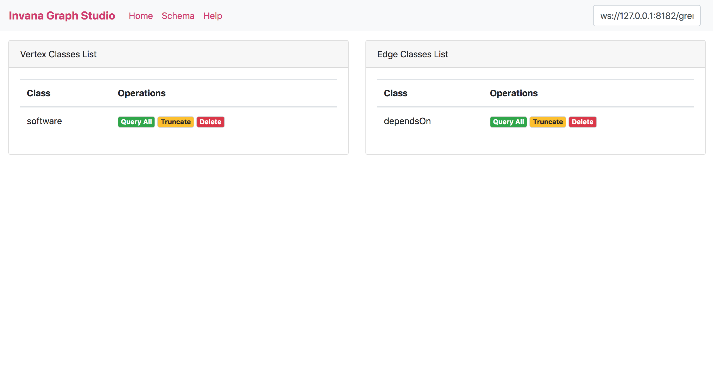

# Invana Graph Studio

Web Editor and Viewer for Graph databases built on top of TinkerPop.

You can start using Invana Graph Studio without any installation. Go to
[https://invanalabs.ai/invana-graph-studio/](https://invanalabs.ai/invana-graph-studio/) and change
the gremlin server URL if needed and You can make the gremlin queries and get the results.

#### Query Editor

#### Schema

#### References:

- http://gremlindocs.spmallette.documentup.com/
- https://github.com/tinkerpop/gremlin/wiki/Gremlin-Steps
- https://docs.janusgraph.org/latest/gremlin.html
- http://tinkerpop.apache.org/docs/current/recipes/