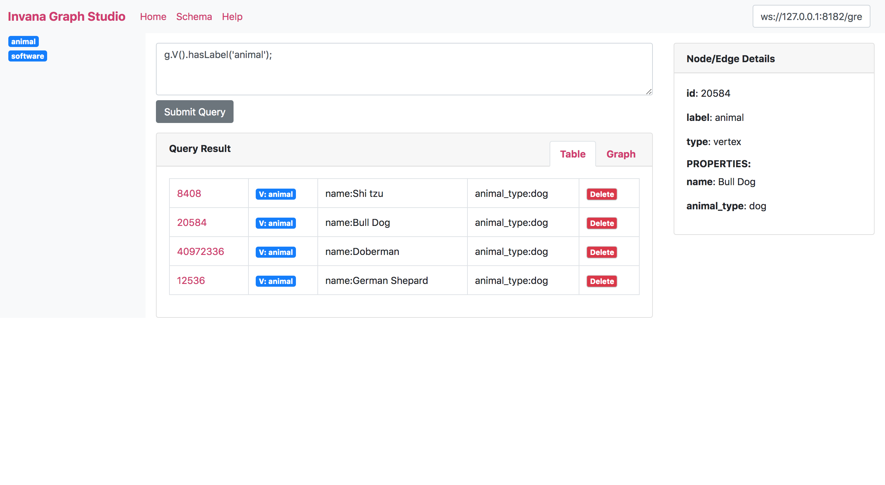

# Invana Graph Studio

Web Editor and Viewer for Graph databases built on top of TinkerPop.

You can start using Invana Graph Studio without any installation. Go to
[https://invanalabs.ai/invana-graph-studio/](https://invanalabs.ai/invana-graph-studio/) and change
the gremlin server URL if needed and You can make the gremlin queries and get the results.

