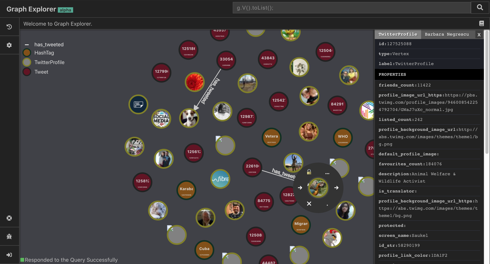

# Invana Studio 
Open source knowledge graphs visualiser and editor.


[](https://github.com/invanalabs/invana-studio/blob/master/LICENSE) 
[](https://travis-ci.org/invanalabs/invana-studio)
[](https://invana-studio.herokuapp.com)
[](https://invana-studio-edge.herokuapp.com)
[](https://hub.docker.com/r/invanalabs/invana-studio)
[](https://github.com/invanalabs/invana-studio/commits)





## Setup Invana Studio

```shell script.
docker run -p 8888:8888 -d --name invana-studio invanalabs/invana-studio
# This will start a invana-studio service at 8888 port. ex: http://localhost:8888
```

If you want to install invana-studio on Heroku 
[click here](https://heroku.com/deploy?template=https://github.com/invanalabs/invana-studio/tree/master).
 

> Invana Studio uses [Invana Engine](https://github.com/invanalabs/invana-engine) as the backend to 
connect to graph databases. Invana Engine is a GraphQL API for Apache TinkerPop supported graph databases.

Refer [here](https://invana.io/get-started.html) for more information on how to setup invana-engine 
and JanusGraph for Invana Studio.

## Todo

- [x] Visualiser
- [ ] Graph Modeller
- [ ] Graph Editor
- [ ] Insights

## Demos

- stable version - [invana-studio.herokuapp.com](http://invana-studio.herokuapp.com/)
- latest version - [invana-studio-edge.herokuapp.com](http://invana-studio-edge.herokuapp.com/)


 

## License

Apache License 2.0

## Support 

For any other assistance, please feel free to get in touch at hi[at]invana.io.
